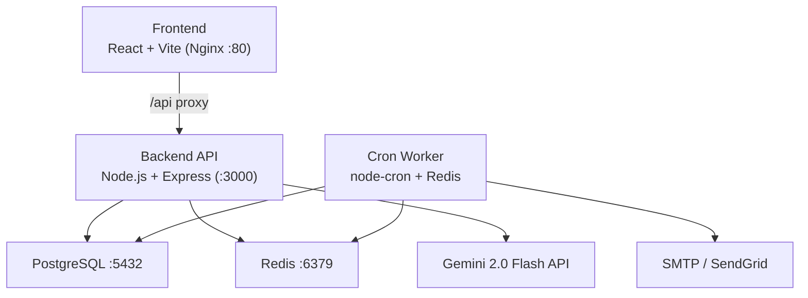
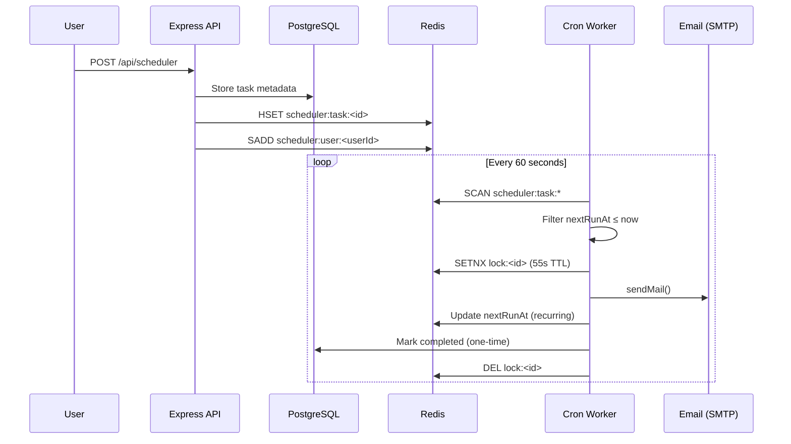

# ⚡ ZenithCatalyst — AI-Powered Habit Coaching Platform

> A production-grade, AI-first habit tracking platform with gamification, smart analytics, and email reminders — fully containerized with Docker and CI/CD.

---

## Architecture



---

## Tech Stack

| Layer | Technology |
|-------|-----------|
| Frontend | React 18, Vite, TanStack Query, Recharts |
| Backend | Node.js 20, Express, Pino logging |
| Database | PostgreSQL 16 (via Prisma ORM) |
| Cache / Queue | Redis 7 (ioredis) |
| AI | Google Gemini 2.0 Flash |
| Scheduler | node-cron + croner (cron expression parser) |
| Email | Nodemailer (SMTP / SendGrid / Resend) |
| Auth | JWT + Refresh token rotation |
| Containerization | Docker (multi-stage Alpine), Docker Compose |
| CI/CD | GitHub Actions → GHCR → SSH deploy |

---

## Quick Start (Docker Compose)

```bash
# 1. Clone and copy env file
cp .env.example .env

# 2. Fill in required secrets in .env
#    - POSTGRES_PASSWORD
#    - JWT_SECRET  (node -e "console.log(require('crypto').randomBytes(64).toString('hex'))")
#    - JWT_REFRESH_SECRET  (same command)
#    - GEMINI_API_KEY  (https://aistudio.google.com/app/apikey)
#    - SMTP_HOST / SMTP_USER / SMTP_PASS  (sendgrid / resend / gmail)

# 3. Run all 5 services
docker compose up -d

# 4. Apply DB schema on first run
docker compose exec backend npx prisma db push

# App is live at http://localhost
```

---

## Local Development (without Docker)

```bash
# Prerequisites: Node 20+, PostgreSQL 16, Redis 7

# Backend
cd backend
cp ../.env.example .env    # fill in DATABASE_URL, REDIS_URL, JWT_SECRET, GEMINI_API_KEY
npm install
npx prisma generate
npx prisma db push        # or migrate dev
npm run dev               # http://localhost:3000

# Frontend
cd frontend
echo "VITE_API_URL=http://localhost:3000/api" > .env
npm install
npm run dev               # http://localhost:5173
```

---

## Environment Variables

| Variable | Required | Description |
|----------|----------|-------------|
| `DATABASE_URL` | ✅ | PostgreSQL connection string |
| `REDIS_URL` | ✅ | Redis connection string (e.g. `redis://localhost:6379`) |
| `JWT_SECRET` | ✅ | 64-char random hex for access tokens |
| `JWT_REFRESH_SECRET` | ✅ | 64-char random hex for refresh tokens |
| `GEMINI_API_KEY` | ✅ | Google AI Studio API key |
| `SMTP_HOST` | ⚠️ | SMTP server (required for email reminders) |
| `SMTP_PORT` | ⚠️ | SMTP port (default: 587) |
| `SMTP_USER` | ⚠️ | SMTP username / API key |
| `SMTP_PASS` | ⚠️ | SMTP password |
| `EMAIL_FROM` | ❌ | Sender address (default: `noreply@zenithcatalyst.app`) |
| `JWT_EXPIRES_IN` | ❌ | Access token TTL (default: `15m`) |
| `JWT_REFRESH_EXPIRES_IN` | ❌ | Refresh token TTL (default: `7d`) |
| `FRONTEND_URL` | ❌ | CORS origin allowed (default: `http://localhost`) |
| `LOG_LEVEL` | ❌ | Pino log level (default: `info`) |

---

## API Endpoints

### Auth — `/api/auth`
| Method | Path | Description |
|--------|------|-------------|
| POST | `/register` | Create account |
| POST | `/login` | Get tokens |
| POST | `/refresh` | Rotate tokens |
| POST | `/logout` | Invalidate refresh token |

### Habits — `/api/habits`
| Method | Path | Description |
|--------|------|-------------|
| GET | `/` | List all habits |
| GET | `/day/:date` | Get habits with completion for a date |
| POST | `/` | Create habit |
| PUT | `/:id` | Update habit |
| DELETE | `/:id` | Delete habit |
| POST | `/:id/toggle` | Toggle completion |
| POST | `/sub/:id/toggle` | Toggle sub-habit |

### AI — `/api/ai`
| Method | Path | Description |
|--------|------|-------------|
| GET | `/summary` | AI performance report |
| GET | `/insights` | Advancements + shortcomings |
| GET | `/suggestions` | New habit suggestions |
| GET | `/forecast` | 7-day predictive analytics |
| GET | `/quote` | Daily motivational quote |
| POST | `/chat` | Conversational coaching |
| POST | `/parse-habit` | NLP → structured habit |
| GET | `/quests/generate` | AI-generated quests |

### Scheduler — `/api/scheduler`
| Method | Path | Description |
|--------|------|-------------|
| GET | `/` | List user's reminders |
| POST | `/` | Create reminder (cron/one-time) |
| PUT | `/:id` | Update or pause/resume |
| DELETE | `/:id` | Delete reminder |
| POST | `/validate` | Validate cron expression |

### Analytics — `/api/analytics`
| Method | Path | Description |
|--------|------|-------------|
| GET | `/` | Timeline, habit stats, categories |
| POST | `/mood` | Log mood & energy |
| GET | `/mood-correlation` | Mood vs completion data |

---

## Scheduler Architecture



**Key properties:**
- **Distributed locking** — `SETNX` with 55s TTL prevents duplicate sends when workers are horizontally scaled
- **Dual write** — Postgres for durable metadata, Redis for fast runtime state
- **DB–Redis sync** — on API server restart, active tasks are automatically synced from Postgres back to Redis
- **Graceful shutdown** — SIGTERM stops the cron job, disconnects Prisma and Redis cleanly

---

## CI/CD Pipeline

```yaml
push to main →
  ├── Lint & TypeCheck (backend + frontend, parallel matrix)
  ├── Backend Tests (real Postgres + Redis service containers)
  ├── Frontend Build (Vite → artifact upload)
  ├── Docker Build & Push (backend, worker, frontend)
  │   └── Tags: sha-<commit>, latest, branch name
  │   └── Platforms: linux/amd64, linux/arm64
  └── Deploy (SSH → docker compose pull && up -d)
```

Secrets required in GitHub:
- `GITHUB_TOKEN` — automatic, used for GHCR push
- `DEPLOY_HOST`, `DEPLOY_USER`, `DEPLOY_SSH_KEY` — for SSH deployment

---

## Docker Services

| Service | Image | Port | Health Check |
|---------|-------|------|-------------|
| `postgres` | `postgres:16-alpine` | 5432 | `pg_isready` |
| `redis` | `redis:7-alpine` | 6379 | `redis-cli ping` |
| `backend` | App (multi-stage Alpine) | 3000 | `GET /health` |
| `worker` | App (cron worker variant) | — | — |
| `frontend` | Nginx (Vite build) | 80 | `nginx-health` |

---

## Features

- 🏠 **Interactive Calendar** — water-fill day cells, SVG progress ring
- 📌 **Habit Management** — CRUD, sub-tasks, categories, color coding
- 🤖 **AI Coach** — chat, insights, forecasting, NLP habit parsing
- ⚔️ **Gamification** — XP, levels, streaks, badges, AI quests
- 📊 **Analytics** — Recharts timeline/pie/bar, mood correlation
- ⏰ **Reminders** — cron-based email scheduler with Redis locking
- 🔐 **Auth** — JWT + refresh token rotation, rate limiting
- 📦 **Docker** — production-optimized multi-stage Alpine images
- 🚀 **CI/CD** — GitHub Actions → GHCR → SSH deploy
