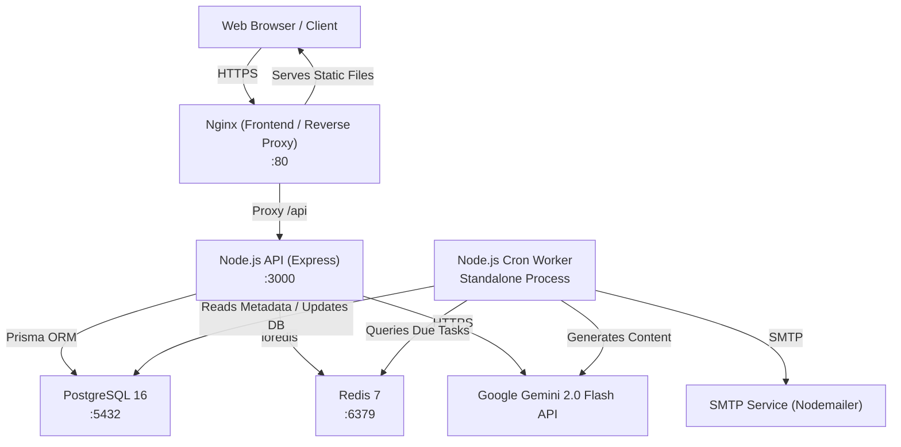
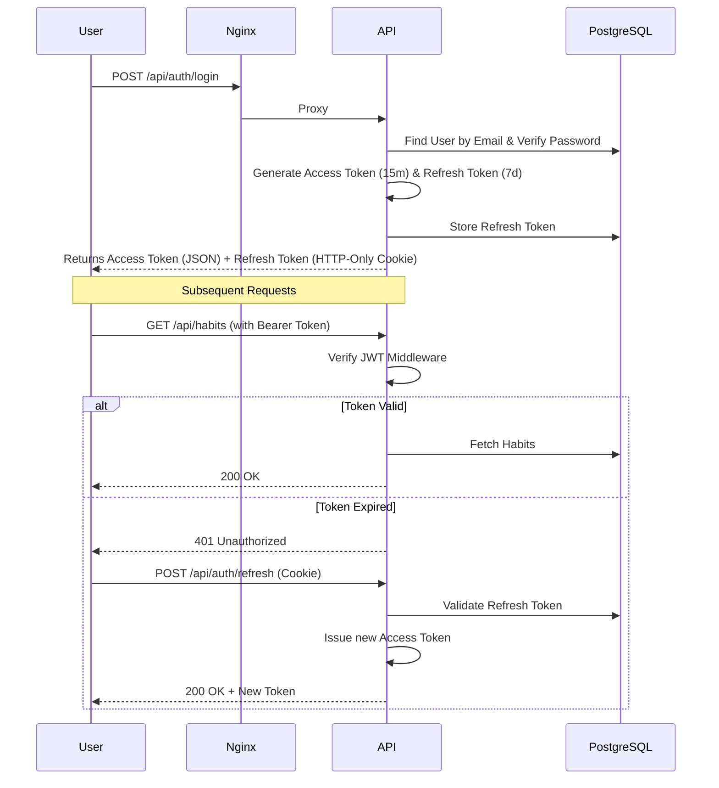
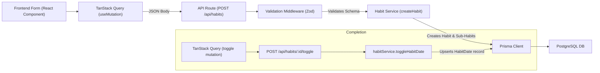
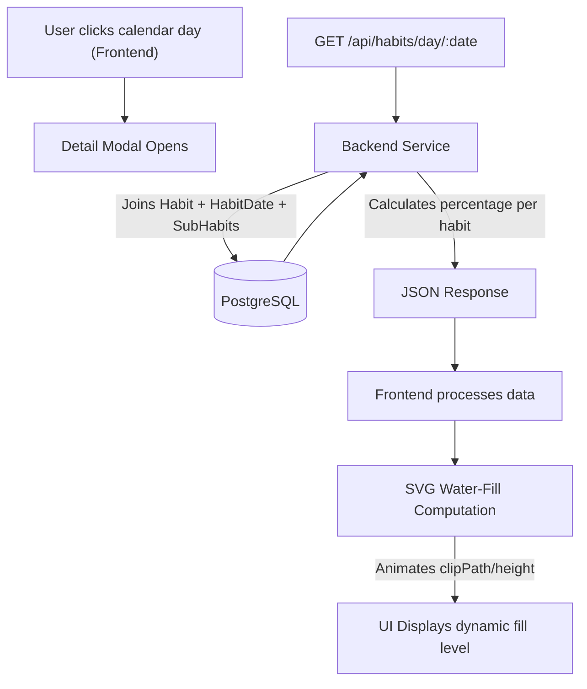
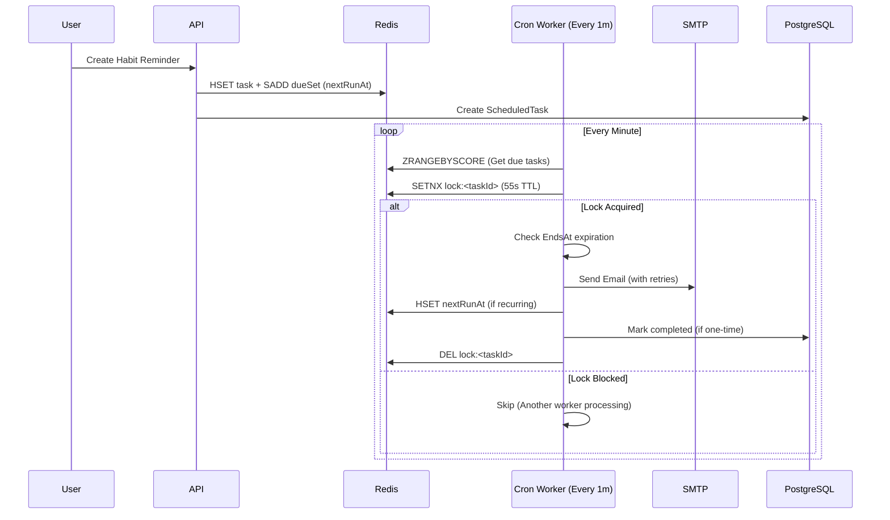
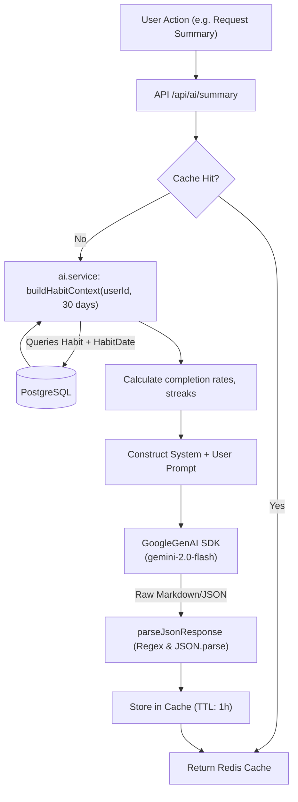
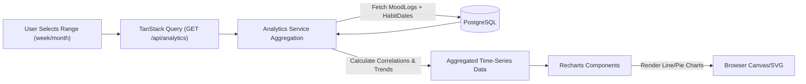
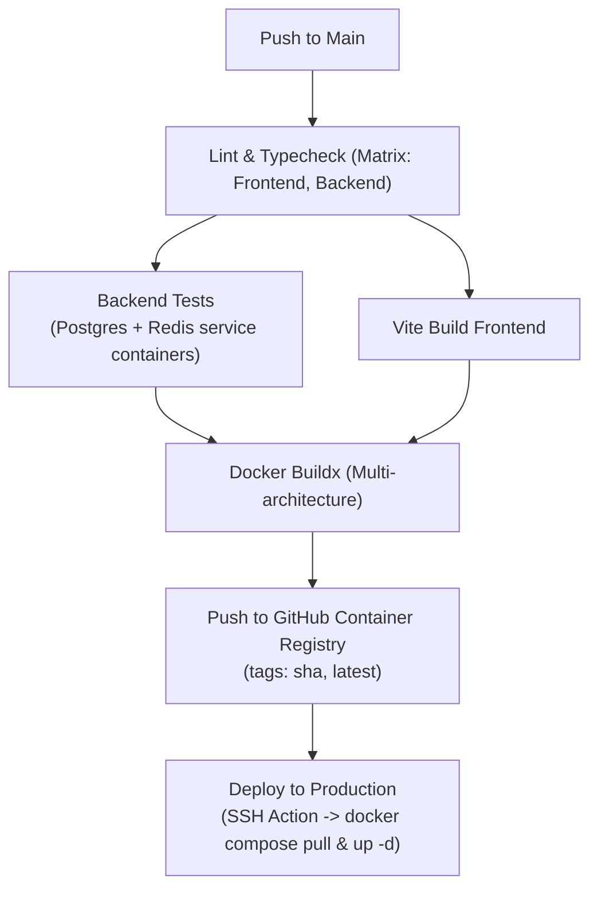
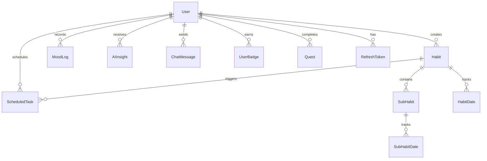

# ZenithCatalyst Platform — Comprehensive Zero-Mercy Audit Report

This report provides a complete, critical audit of the ZenithCatalyst AI-powered platform. It is designed to identify all architectural weaknesses, logic flaws, bugs, and deviations from production readiness.

> [!WARNING]
> **This is an execution blocker.** No code changes will be made until you review these findings and explicitly approve the remediation plan.

---

## 🎨 Visual Documentation

### 1. System Architecture Overview


### 2. Authentication & Authorization Flow


### 3. Habit Creation & Completion Data Flow


### 4. Calendar & Water-Fill Workflow


### 5. Email Scheduler Flow


### 6. AI Integration Data Flow


### 7. Analytics Data Flow


### 8. CI/CD Pipeline Stages


### 9. Database Entity-Relationship (ER) Diagram


---

## 🔬 Section 1: Code Quality, Bugs & Logic Review

### Critical Issues
1. **JSON Parsing Flaw in AI Service**  
   - **File:** `backend/src/services/ai.service.ts` (`parseJsonResponse`)
   - **Description:** The regex `raw.replace(/```json\n?/g, '')` is fragile. If the AI returns trailing text or nested markdown blocks, `JSON.parse` will throw an unhandled exception, causing 500 errors.
   - **Fix:** Implement robust parsing using a dedicated validation library (Zod) inside the AI service to parse and safely fallback or retry.

2. **Unhandled Promise Rejections in Worker Tick**  
   - **File:** `backend/src/worker/index.ts` (`tick`)
   - **Description:** While individual task failures are caught, if `getDueTaskIds()` or the Redis connection fails entirely, the error is logged but could eventually crash the cron job without triggering PM2/Docker restarts cleanly.

### High Issues
3. **Implicit "any" / Type Safety in AI Cache**  
   - **File:** `backend/src/services/ai.service.ts`
   - **Description:** The `cache` map stores `unknown` data. Functions like `getInsights` use `getCached<unknown>` and assume structure, bypassing TypeScript's safety.
   - **Fix:** Implement typed interfaces for all AI responses (e.g., `InsightResponse`) and use `getCached<InsightResponse>`.

4. **N+1 Query Risk in Habit Aggregation**  
   - **File:** `backend/src/services/ai.service.ts` (`buildHabitContext`)
   - **Description:** The code iterates through multiple days to calculate completion loops in JavaScript/TypeScript rather than leveraging Prisma's native `groupBy` or raw SQL. While functional for a few habits, this will drastically slow down as users accumulate years of data.
   - **Fix:** Shift the aggregation logic to a direct PostgreSQL query using `COUNT` and `FILTER` clauses.

### Medium Issues
5. **Missing Global Rate Limiter**  
   - **File:** `backend/src/routes/ai.ts`
   - **Description:** Only `aiLimiter` is present. Authentication routes (`/login`, `/register`) desperately need strict rate limiting to prevent brute-force attacks.
6. **Hardcoded Timezones**  
   - **File:** `backend/src/services/scheduler.service.ts`
   - **Description:** Tasks default to `UTC` if not provided. In the DB schema, `ScheduledTask` defaults to `UTC`. If the client doesn't send the user's timezone reliably, reminders trigger at the wrong local time.

---

## 🤖 Section 2: AI Integration Review

### Data Privacy & Serialization
- **Current State:** The system serializes entire `Habit` objects and sends them to Gemini. `buildHabitContext` includes descriptions, priorities, and custom sub-habit text.
- **Risk (High):** Sub-habits or notes might contain Personally Identifiable Information (PII) or sensitive health data. The prompts do not instruct the AI to respect privacy boundaries strictly.
- **Fix:** Implement a sanitization step before `JSON.stringify(ctx.habits)`. Anonymise user IDs completely (already done by only sending habit stats, but ensure no user names slip into `getMotivationalQuote` without care).

### Prompt Engineering
- **Current State:** System prompts are embedded directly inside string templates. They enforce JSON structure natively (which is good).
- **Risk (Medium):** There's no fallback mechanism if Gemini refuses to answer due to Google's strict safety settings (e.g., if a habit contains words like "medication" or "drinking", Gemini might trigger a safety block and return an empty string, crashing the JSON parser).
- **Fix:** Check `response.promptFeedback` and `response.text`. Provide a graceful empty state if blocked.

### Cache Strategy
- **Current State:** In-memory caching (`Map<string, CacheEntry>`) is used.
- **Risk (High):** When the backend runs in multiple Docker containers (horizontal scaling), the cache is not shared. Each instance will make duplicate expensive API calls.
- **Fix:** Move AI caching strictly to Redis.

---

## ⏰ Section 3: Scheduler Architecture & Workflow Review

### Lock TTL vs. Task Duration Risk
- **Current State:** The cron worker uses `SETNX lock:<id>` with a 55-second TTL.
- **Risk (Critical):** If an email provider (e.g., SMTP) hangs for 60 seconds (retry delays total `2000+5000+15000 = 22s`, plus execution time), the lock expires. The next cron tick might pick up the *same* task and send a duplicate email before the first one finishes and updates `nextRunAt`.
- **Fix:** The worker should extend the lock heartbeat if execution takes longer than 30 seconds, or set the initial lock TTL to 2-3 minutes while ensuring process crashes still release the lock via robust `finally` blocks.

### Scalability Limit
- **Current State:** `getDueTaskIds()` fetches tasks sequentially. `for (const id of taskIds) { await processTask(redis, id); }`.
- **Risk (Medium):** Processing is sequential. If 10,000 users have an email scheduled at 08:00 AM, processing them sequentially with `await` will take longer than a minute, causing severe backlog and delayed emails.
- **Fix:** Implement bulk processing using `Promise.allSettled` with a concurrency limit (e.g., `p-map` with concurrency of 50).

---

## 🗄️ Section 4: Database Schema Audit

### Evaluation of `schema.prisma`
- **Missing Foreign Key Indexes:** Prisma creates constraints, but for heavy JOIN operations, manual indexes are better. Example: `HabitDate` has `@@unique([habitId, date])` but `date` alone isn't indexed for fast "get all habits for today" queries.
- **Data Integrity (High):** `isArchived` is a boolean, but what about hard deletes? Deleting a User cascades to Habits, MoodLogs, and AIInsights. This is correct, but deleting a Habit cascades to ScheduledTasks. If a user deletes a habit, they lose all historical analytics tied to it.
- **Fix:** Consider soft-delete models (`deletedAt`) for Habits instead of `Cascade` on historical tables to preserve XP and analytic integrity.

---

## 🐳 Section 5: Docker & CI/CD Review

### Dockerfile Optimizations
- **Backend Dockerfile:** Uses `node:20-alpine`. Employs multi-stage builds. Uses `dumb-init` to handle signals. This is excellent.
- **Risk (Low):** Prisma CLI is required in production image `node_modules` which inflates image size. Only `prisma-client` should be required.
- **Frontend Nginx:** Very robust cache-control headers.

### CI/CD Pipeline
- **Current State:** Linting, Prisma generation, backend tests with service containers, Vite build, Multi-arch Docker build via Buildx, and SSH deployment.
- **Risk (High):** The DB push uses `npx prisma db push --accept-data-loss` in testing, which is fine, but there is no step verifying actual migration generation (`npx prisma migrate status`). If deployed, `prisma db push` could wipe out columns in production if the user isn't careful.
- **Fix:** Use `npx prisma migrate deploy` in production CI/CD instead of `db push`.

---

## 📊 Section 6: Overall Health Assessment

### Dashboard summary

| Severity | Count | Primary Affected Area |
|----------|-------|-----------------------|
| 🚨 **Critical** | 2 | Cron Duplicate Locking, AI Response Parsing |
| ⚠️ **High** | 4 | AI Memory Cache, DB Migrations, Sequential Worker |
| 🚸 **Medium** | 3 | Rate Limiting, Missing Soft-Deletes |
| ℹ️ **Low** | 2 | Docker Image Size, Implicit Types |

### Subsystem Readiness Scores

- **Frontend Architecture:** 8.5/10 (Solid TanStack/Vite setup, strong UX foundation)
- **Backend API & Auth:** 7.5/10 (Missing critical rate limiters and robust validation)
- **AI Integration:** 6.0/10 (Needs Redis caching, safe JSON parsing, and safety fallbacks)
- **Cron / Scheduler:** 7.0/10 (Locking is implemented but sequential processing will bottleneck)
- **Database Schema:** 8.0/10 (Good relations, but needs soft deletes for analytics integrity)
- **CI/CD Pipeline:** 8.5/10 (Very modern GitHub actions setup, robust testing containers)

### Top 5 Must-Fix Items Before Production
1. **Refactor AI JSON parsing** to use `try/catch` and regex stripping with Zod validation.
2. **Shift AI caching from memory to Redis** to allow horizontal backend scaling.
3. **Change Cron Worker execution** from sequential `for...of` to concurrent batch processing (`Promise.allSettled`).
4. **Implement Global Rate Limiters** on the Express API, specifically for auth routes.
5. **Adjust `docker-compose.yml` / CI pipeline** to strictly use `prisma migrate deploy` instead of `db push` to prevent accidental production data loss.

---
> [!IMPORTANT]
> **Awaiting Feedback**
> Please review the architectural maps and findings. Let me know if you approve this audit. Once approved, I will sequentially implement the fixes starting with the critical AI JSON and Worker locking bottlenecks.
